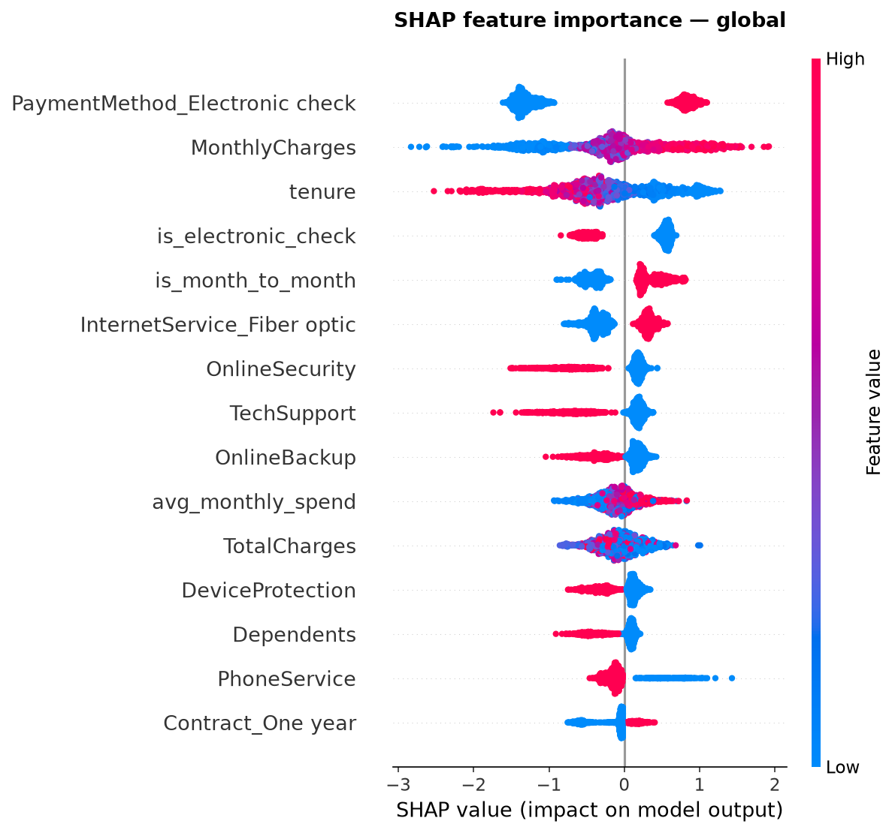

# 📊 Customer Churn Prediction — End-to-End ML Pipeline

[](https://github.com/Tanya-1109/customer-churn-prediction/actions)
[](https://www.python.org/)
[](LICENSE)

An end-to-end machine learning system that predicts customer churn for a telecom company, complete with explainable AI, a REST API, and an interactive demo app.

**🎯 [Try the live demo](your-streamlit-cloud-link-here)** | **📓 [View EDA notebook](notebooks/01_eda.ipynb)**


---

## 🚀 Project highlights

- **84% ROC-AUC** on held-out test data using a tuned XGBoost classifier
- **SHAP explainability** — every prediction comes with the top 3 drivers, not just a black-box score
- **Bayesian hyperparameter tuning** with Optuna (50 trials, 5-fold stratified CV)
- **Production-style architecture** — sklearn Pipeline, FastAPI service, Streamlit UI, Docker container
- **MLflow experiment tracking** comparing 5 models and 2 imbalance-handling strategies
- **CI pipeline** with automated testing on every push

---

## 📁 Problem statement

Telecom companies lose 15–25% of customers annually to churn. Acquiring a new customer costs **5–25x more** than retaining an existing one. This project builds a model that identifies at-risk customers *before* they churn, with explainable predictions a retention team can act on — not just a probability score.

**Dataset:** [Telco Customer Churn (Kaggle)](https://www.kaggle.com/datasets/blastchar/telco-customer-churn) — 7,043 customers, 26.5% churn rate.

---

## 🏗️ Architecture

Raw customer data

│

▼

┌─────────────────────┐

│  sklearn Pipeline     │

│  ├─ Feature engineering │

│  ├─ Encoding/scaling   │

│  └─ XGBoost classifier │

└─────────────────────┘

│

├──► FastAPI REST endpoint (/predict)

└──► Streamlit interactive dem

---

## 📊 Key findings from EDA

| Finding | Business implication |
|---|---|
| Month-to-month contracts churn at 43% vs 3% (two-year) | Contract type is the strongest churn signal |
| New customers (<12 months tenure) churn disproportionately | Early-lifecycle retention programs needed |
| Fiber optic users churn more than DSL | Possible pricing/satisfaction issue worth investigating |
| No tech support / online security correlates with churn | Bundle these as retention incentives |

*Full analysis: [`notebooks/01_eda.ipynb`](notebooks/01_eda.ipynb)*

---

## 🧪 Model performance

| Model | ROC-AUC | F1 | Recall | Precision |
|---|---|---|---|---|
| Logistic Regression (baseline) | 0.83 | 0.61 | 0.65 | 0.57 |
| Random Forest | 0.83 | 0.60 | 0.67 | 0.55 |
| XGBoost (SMOTE) | 0.82 | 0.59 | 0.61 | 0.57 |
| XGBoost (scale_pos_weight) | 0.83 | 0.62 | 0.73 | 0.53 |
| **XGBoost (Optuna-tuned)** ⭐ | **0.83** | **0.61** | **0.62** | **0.59* |

> Recall was prioritized over raw accuracy: a missed churner (false negative) costs significantly more than an unnecessary retention offer (false positive). Decision threshold tuned to 0.35 (vs default 0.5) to optimize for this business cost asymmetry.

*Full comparison in MLflow: see [`notebooks/03_modelling.ipynb`](notebooks/03_modelling.ipynb)*

---

## 🔍 Explainability

Every prediction is paired with SHAP values showing exactly why the model flagged a customer:



Top global drivers: contract type, tenure, monthly charges, internet service type, and tech support status — all features identified during EDA and validated post-hoc by the model's actual behavior.

---

## ⚙️ Tech stack

| Category | Tools |
|---|---|
| Data & ML | pandas, scikit-learn, XGBoost, LightGBM, imbalanced-learn |
| Explainability | SHAP |
| Experiment tracking | MLflow |
| Hyperparameter tuning | Optuna (TPE Bayesian sampler) |
| API | FastAPI, Pydantic |
| Demo UI | Streamlit, Plotly |
| Testing | pytest, httpx |
| CI/CD | GitHub Actions |
| Containerization | Docker |

---

## 🛠️ Setup & usage

```bash
# Clone and install
git clone https://github.com/YOUR_USERNAME/customer-churn-prediction.git
cd customer-churn-prediction
python -m venv venv && source venv/bin/activate
pip install -r requirements.txt

# Train the model
python -m src.models.train_final

# Run the API
uvicorn app.api.main:app --reload

# Run the Streamlit demo
streamlit run app/streamlit_app.py

# Run tests
pytest tests/ -v
```

---

## 📂 Project structure

customer-churn-prediction/

├── notebooks/          # EDA, feature engineering, modelling, evaluation

├── src/

│   ├── features/        # feature engineering pipeline

│   └── models/          # training, tuning, pipeline, evaluation

├── app/

│   ├── api/              # FastAPI service

│   └── streamlit_app.py  # interactive demo

├── tests/               # unit + integration tests

├── models/               # serialized pipeline

├── reports/figures/      # EDA & SHAP visualizations

└── .github/workflows/    # CI pipeline

---

## 🔮 Future improvements

- [ ] Add model monitoring for prediction drift over time
- [ ] A/B test retention interventions against model recommendations
- [ ] Deploy API to a cloud endpoint (AWS Lambda / GCP Cloud Run)
- [ ] Add a model registry stage-transition workflow in MLflow

---

## 📄 License

MIT — see [LICENSE](LICENSE)